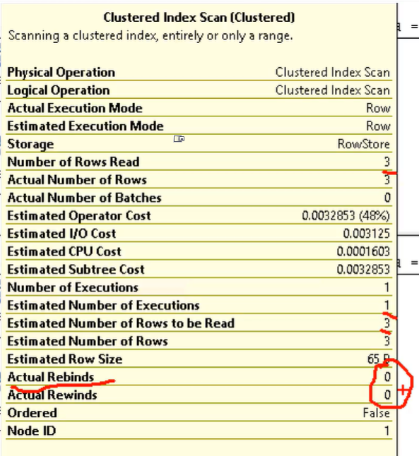

# IamTC_SQL-Database
Iam Tim Corey - SQL Database from start to finish 

## SQL SERVER (docker image)

[hub docker - sql server ](https://hub.docker.com/_/microsoft-mssql-server)

`docker run -e "ACCEPT_EULA=Y" -e "MSSQL_SA_PASSWORD=yourStrong(!)Password" -p 1433:1433 -d mcr.microsoft.com/mssql/server:2019-latest`

Con il contanier avviato si ha un SQL SERVER Express in ascolto su `localhost` porta `1433`

Per accadere usare l'autenticazione di tipo `Motore di Databse` accaunt `sa` con la password inserita all'interno del comando docker `run`


> L'account `sa` sta per "System Administarator".


## Microsoft SQL Server Management Studio (SSMS)

Scorciatoie da tastiera:

- `F5`: esegue la query ho il codice selezionato.

- `Ctrl + R`: apre / chiude la vista dei risultati.

- `Ctrl + SHIFT + R`: refresh the query windows text


## Create database: 'TimeSheets' 

Creato un nuovo database 'TimeSheets' con le seguenti impostazioni:

- File RAW: initial size 40MB, Autogrowth (default) 64, Maxsize (default) unlimited;

- File LOG: initial size 20MB, Autogrowth (default) 64, Maxsize (default) unlimited;


Opzioni:

- Compatibility level: SQL Server 2016

- Recory Mode: Full (in production), Simple (in developer machine)

Per creare un database attraverso uno script sql con i valori di default basta la seguente istruzione:

```
CREATE DATABASE [TimeSheets];
```

per eliminare un database dal server si usano l' istruzione:
```
DROP DATABASE [db-name];
```

## Table

Create le tabelle attraverso SSMS e salvati gli script nel repository.

`dbo`: is the default *data base owner*

## Inserimento di dati di prova nelle tabelle

### 1) Metodo
Selezionare la tabelle e con il tasto dx del mouse scegliere l'opzione 'Edit Top 200 row'.

### 2) Metodo
Attraverso una query di script.

```
INSERT INTO dbo.Customers (CompanyName, PhoneNumber, EmailAddress)
VALUES ('XYZ Corp.', '555-1212', 'hr@xyz.org');

```


## Query

- `inner join`: only the records that match.

- `left join`: all the records from the left table, and all the mathching records from the right table.

- `right join`: all the records from the right table, and all the mathching records from the left table


## Foreing Key Relationships
Informare il motore SQL sulle relazioni esistenti tra le varie tabelle del database aiuta nelle prestazioni di esecuzione delle query. Inoltre si può stabilire quale politica adottare sulla modifica o eliminazione dei record interessati alle relazioni.

> `Foreing Key` è la parte MOLTI della relazione.


## Extimate Execution Plan
SSMS fornisce strumenti per stimare il tempo di esecuzione delle query, in particolare mostra che percentuale del tempo di esecuzione occupano le varie istruzione dello script.

Attraverso lo strumento *Extimate Execution Plan* è possibile, ed è molto utile, confrontare due query diverse che svolgono compiti simili. Queste vengono messe a confronto sotto forma di percentuale, quella che ottiene una percentuale minore svolge il lavoro più efficacemente.

Attivando l'opzione `Actual Execution Plan` dopo aver eseguito la query o le query è possibile stimare eventuali problemi interni al database.

